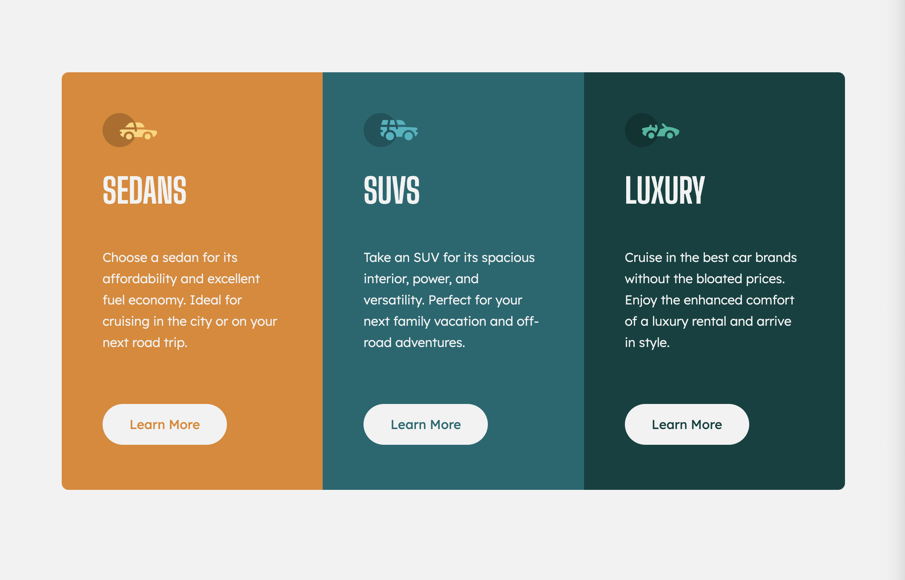

# Frontend Mentor - 3-column preview card component solution

This is a solution to the [3-column preview card component challenge on Frontend Mentor](https://www.frontendmentor.io/challenges/3column-preview-card-component-pH92eAR2-). Frontend Mentor challenges help you improve your coding skills by building realistic projects. 

## Table of contents

- [Overview](#overview)
  - [The challenge](#the-challenge)
  - [Screenshot](#screenshot)
  - [Links](#links)
  - [Built with](#built-with)
  - [Useful resources](#useful-resources)
- [Author](#author)

## Overview

A solution to the 3-column preview card component challenge on Frontend Mentor.

### The challenge

Users should be able to:

- View the optimal layout depending on their device's screen size
- See hover states for interactive elements

### Screenshot

### Links

- Solution URL: [Add solution URL here](https://your-solution-url.com)
- Live Site URL: [Add live site URL here](https://your-live-site-url.com)

### Built with

- Semantic HTML5 markup
- CSS custom properties
- Flexbox

### Useful resources

- [W3 Schools](https://www.w3schools.com/) - This helped me as a reference for HTML & CSS during the project.
- [MDN Web Docs](https://developer.mozilla.org/en-US/) - Really helpful resource for HTML & CSS including Flexbox.

## Author

- GitHub - [Heather O'Grady](https://www.github.com/Heather-ogrady)
- Frontend Mentor - [@Heather-ogrady](https://www.frontendmentor.io/profile/Heather-ogrady)
